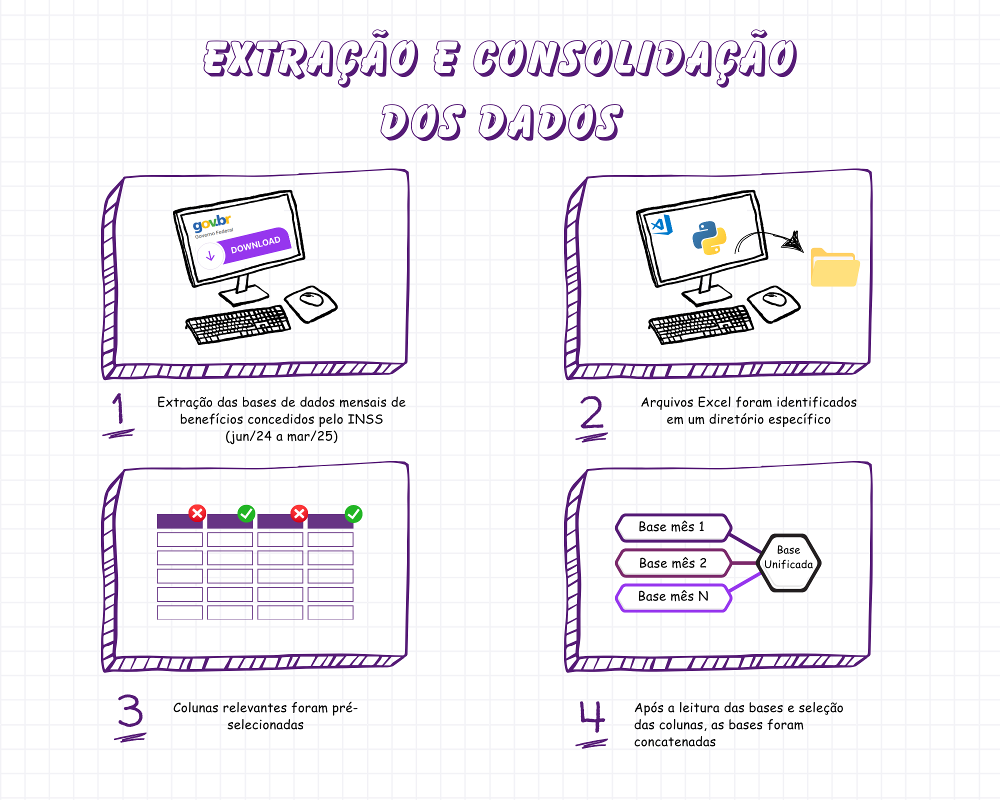
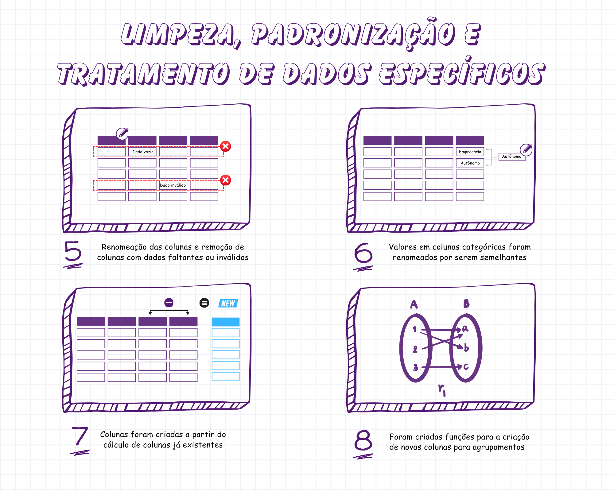
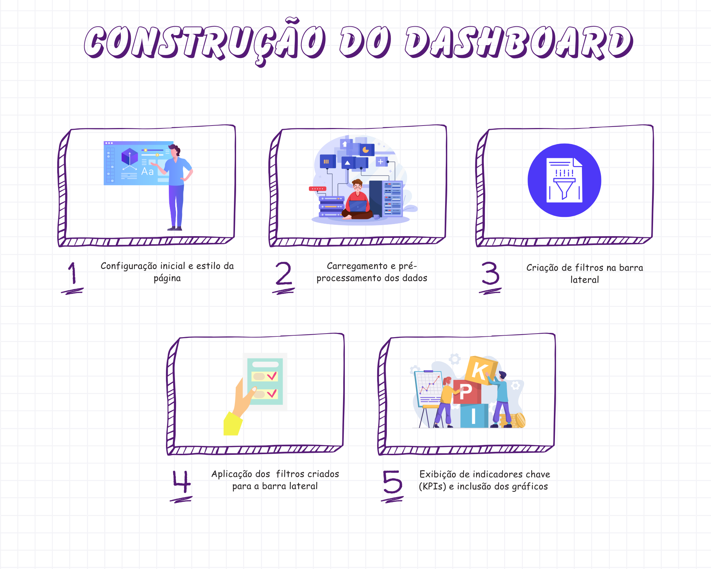

# 𝐃𝐚𝐬𝐡𝐛𝐨𝐚𝐫𝐝 𝐄𝐱𝐩𝐥𝐨𝐫𝐚𝐭𝐨𝐫𝐢𝐨: 𝐁𝐞𝐧𝐞𝐟𝐢𝐜𝐢𝐨𝐬 𝐈𝐍𝐒𝐒 

O objetivo deste projeto é disponibilizar um dashboard interativo com dados dos benefícios concedidos pelo INSS durante um período de 10 meses, entre junho de 2024 e março de 2025.

---

# ▸ ʙᴀsᴇ ᴅᴇ ᴅᴀᴅᴏs

As bases utilizadas estão disponíveis no site do governo, estão separadas por mês e os metadados também estão disponíveis no site. Para iniciar o tratamento, verifiquei se as bases possuem a mesma estrutura. 

>➛ Caso for extraí-las diretamente do site, se atente ao fato de que algumas bases utilizam a primeira linha da tabela para título e nem sempre possuem as mesmas colunas e os arquivos presentes no repositório já estão com os devidos ajustes.

---

## ▸ ᴄᴏᴍᴏ ᴏ ᴛʀᴀᴛᴀᴍᴇɴᴛᴏ ᴅᴏs ᴅᴀᴅᴏs ғᴏɪ ʀᴇᴀʟɪᴢᴀᴅᴏ?

Após o download das bases, os arquivos foram salvos em excel na pasta bases_inss e todo o tratamento foi feito no Python usando o VS Code.

  
  

    𝟙. ᴇxᴛʀᴀçᴀᴏ ᴇ ᴄᴏɴsᴏʟɪᴅᴀᴄᴀᴏ ᴅᴏs ᴅᴀᴅᴏs

    𝟚. ʟɪᴍᴘᴇᴢᴀ ᴇ ᴘᴀᴅʀᴏɴɪᴢᴀçᴀᴏ ɪɴɪᴄɪᴀʟ

    𝟛. ᴇɴɢᴇɴʜᴀʀɪᴀ ᴅᴇ ᴀᴛʀɪʙᴜᴛᴏs ᴇ ᴛʀᴀᴛᴀᴍᴇɴᴛᴏ ᴅᴇ ᴅᴀᴅᴏs ᴇsᴘᴇᴄɪғɪᴄᴏs

    𝟜. ᴏᴛɪᴍɪᴢᴀᴄᴀᴏ ᴅᴀ ᴇsᴛʀᴜᴛᴜʀᴀ ᴅᴏs ᴅᴀᴅᴏs

    𝟝. ᴄʀɪᴀçᴀᴏ ᴅᴇ ɪɴᴅɪᴄᴀᴅᴏʀᴇs ᴇ ɴᴏᴠᴀs ᴄᴀᴛᴇɢᴏʀɪᴀs

    𝟞. ᴀɢʀᴇɢᴀçᴀᴏ ᴇ ɴᴏʀᴍᴀʟɪᴢᴀçᴀᴏ

    𝟟. ᴇxᴘᴏʀᴛᴀçᴀᴏ ᴅᴏ ʀᴇsᴜʟᴛᴀᴅᴏ

---

## ▸ ᴄᴏᴍᴏ ᴏ ᴅᴀsʜʙᴏᴀʀᴅ ғᴏɪ ғᴇɪᴛᴏ?

O Dashboard foi feito através do 𝑺𝒕𝒓𝒆𝒂𝒎𝒍𝒊𝒕 seguindo as etapas abaixo:

  

    𝟙. ᴄᴏɴғɪɢᴜʀᴀçᴀᴏ ɪɴɪᴄɪᴀʟ ᴇ ᴇsᴛɪʟᴏ ᴅᴀ ᴘᴀɢɪɴᴀ

    𝟚. ᴄᴀʀʀᴇɢᴀᴍᴇɴᴛᴏ ᴇ ᴘʀᴇ-ᴘʀᴏᴄᴇssᴀᴍᴇɴᴛᴏ ᴅᴏs ᴅᴀᴅᴏs

    𝟛. ᴄʀɪᴀçᴀᴏ ᴅᴇ ғɪʟᴛʀᴏs ɴᴀ ʙᴀʀʀᴀ ʟᴀᴛᴇʀᴀʟ (sɪᴅᴇʙᴀʀ)

    𝟜. ᴀᴘʟɪᴄᴀçᴀᴏ ᴅᴏs ғɪʟᴛʀᴏs ᴀᴏs ᴅᴀᴅᴏs

    𝟝. ᴇxɪʙɪçᴀᴏ ᴅᴇ ɪɴᴅɪᴄᴀᴅᴏʀᴇs ᴄʜᴀᴠᴇ (ᴋᴘɪs) ᴇ ɢʀᴀғɪᴄᴏs

---

## ▸ ᴅᴀsʜʙᴏᴀʀᴅ ᴇ ɪɴsɪɢʜᴛs

  

Uma análise interessante que este dashboard possibilita é a nítida diferença entre gêneros ao se examinar categorias específicas de CID relacionadas à saúde mental e comportamental. 

Ao filtrar por "Transtornos mentais e comportamentais" no gráfico "Taxa por Mês e Sexo", a taxa de benefícios concedidos a mulheres é significativamente maior que a dos homens. Curiosamente, a situação se inverte ao selecionar a categoria "Traumatismos e envenenamentos", onde a taxa de benefícios para homens se mostra consideravelmente superior.

### ❯ ᴄᴏɴᴛᴀᴛᴏs ᴅᴏ ᴀᴜᴛᴏʀ :

  

